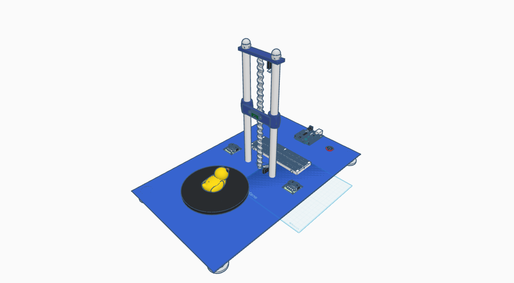
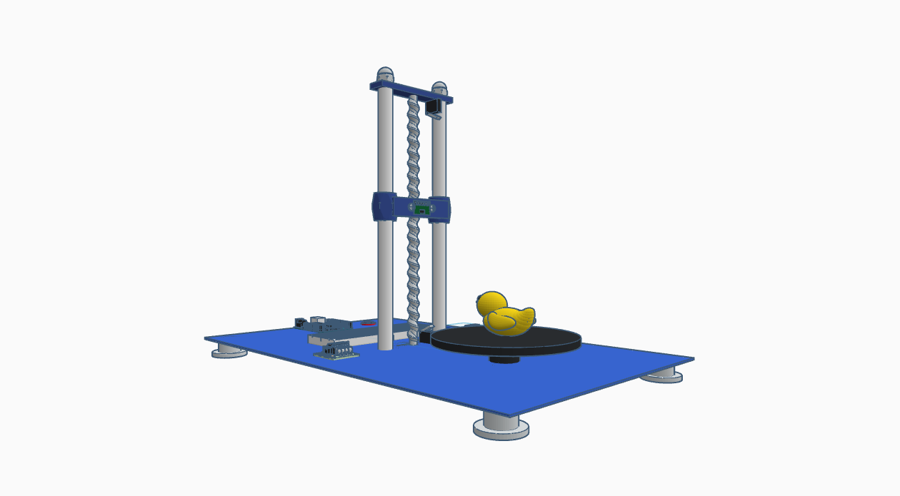
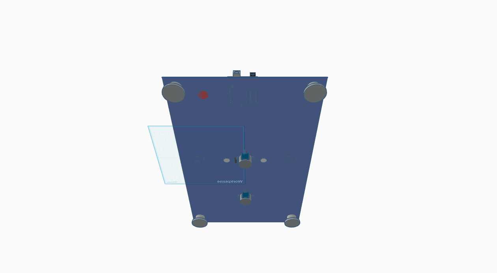

# 3D Scanner Project

## How it started

This is a project created for the **Electrical Machines and Drives** university course. The main criteria for the project was to use an electrical motor.

## About the project

This is 3D scanning system built using an IR distance sensor and 2 stepper motors. The project transform the geometry of real objects into a Point Cloud and generates a 3D surface (Mesh), ready for 3D printing.

## Features

* **GUI**: An app written in Python (Tkinter library) with support for keyboard navigation, real-time log updates via Threading and automatic COM port management.
* **Automatic Surface Reconstruction**: Transform `.xyz` data into a 3d Model (`.obj`) using PyMeshLab
* **2-Axis Kinematics**: Control of the rotating turntable and the elevator using stepper motors and mechanical endstops.

[For information about software side of the project click here](./app_code/README.md)

## Hardware

### Bill of Materials

* **Microcontroller:** 1x Arduino Uno
* **Motors:** 2x 5V 28BYJ-48 Stepper Motors + Drivers
* **Sensor:** 1x Sharp GP2Y0A41SK0F (4-30 cm) IR sensor
* **Power Supply:** 1x 9v, 0.55A Power Supply (for motors)
* **Other Components for Arduino:**
  * 2x Mechanical Endstop (for bottom and upper parts of the threaded rod)
  * 1x Electrical Switch
  * Resistors (2x 100k, 10k)
  * Breadboard
* **Other components:**
  * 1x M8 Threaded Rod (for Z-axis)
  * 3x Hex Nuts
  * 2x Round Bars
  * 2x Low Pressure Ferrule
  * 1x Aluminium Flexible Coupling 5mm * 8mm (between motor's rod and M8 threaded rod)
  * Turntable (from a pick-up)
  * 2x Steel Flat Bar

### Components connections

* Sharp GP2Y0A41SK0F (4-30 cm) IR sensor: A0, GND, 5V
* Motors:
  * Turntable: 8-11 digital, breadboard +/-
  * Threaded Rod: 4-7 digital, breadboard +/-
* Mechanical Endstops:
  * Upper: from NO - breadboard - digital 3, breadboard -
  * Bottom: from NO - breadboard - digital 2, breadboard -
* Power Supply: + - breadboard + - voltage divider (110k, 100k) - digital 1, - to Electrical Switch to breadboard -

### [TinkerCad project design](https://www.tinkercad.com/things/5zCmhctaVLh-3d-scanner?sharecode=bmv8x4omlR0UC9AtyNq_ofs1a5cjaq0OV72FfIZm1b8)

### Real-life images of the scanner

### Future hardware updates

* change IR sensor with a camera and get coordinates from images
* change M8 rod with a T8 Threaded rod for faster movement on it
